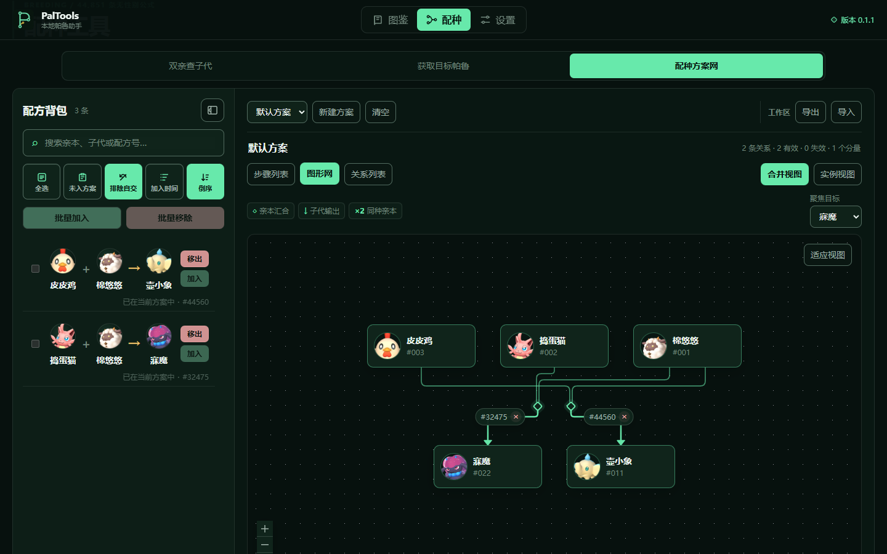

<p align="center">
  
</p>

<h1 align="center">PalTools</h1>

<p align="center">
  把帕鲁资料、配种查询、路线整理和可核对的智能问答，放进一个安静、快速的桌面工作台。
</p>

<p align="center">
  <strong>300 个帕鲁</strong> · <strong>44,851 条配方</strong> · 核心功能离线可用 · 无需账号 · 不读取游戏存档
</p>

<p align="center">
  <a href="https://github.com/anApalpitate/PalTools/releases/latest"><strong>下载 Windows 便携版</strong></a>
  &nbsp;·&nbsp;
  <a href="#快速上手">快速上手</a>
  &nbsp;·&nbsp;
  <a href="docs/README.md">项目文档</a>
</p>


## 从查资料，到走通一条配种路线

PalTools 是一款面向《幻兽帕鲁》玩家的非官方本地优先辅助工具。它不要求登录，也不会触碰游戏存档；打开之后，就可以专心完成资料查询、配种规划与路线整理。需要时，还可以连接你自己的模型 API，把本地资料整理成一条带证据的回答。

| 查清一只帕鲁 | 找到一条配方 | 整理完整方案 |
| --- | --- | --- |
| 按名称、拼音、编号、属性、工作适性和能力数值检索 300 个帕鲁。 | 用任意亲本查询子代，或从目标帕鲁反查所有可用亲本组合。 | 把配方收藏进背包，组合为多个方案，并用步骤、关系或图形网查看。 |

上述图鉴与配种查询都在本机完成。资料、主题和配种工作区保存在本地，断网后仍然可用。

## 用自己的模型，问本地帕鲁知识

“帕鲁研究终端”会先检索应用内的图鉴、技能、词条、掉落与配种索引，再把必要证据交给你选择的模型组织答案。回答旁的档案编号可展开实际检索记录，并直接跳回图鉴或配种页面。

- 内置 OpenAI、Azure OpenAI、Anthropic、Gemini、DeepSeek、通义千问、Kimi、智谱、硅基流动、xAI、Mistral、OpenRouter、Ollama 与自定义接口模板。
- 游戏事实只接受本地证据；没有足够依据时明确拒答，不启用厂商网页搜索或代码执行。
- Windows 桌面版使用系统安全存储加密 API Key；Web 版只在当前页面内存中保留密钥，刷新即清除。
- 助手联网完全可选。没有 API 配置或网络时，图鉴、配种与方案工作区仍保持完整可用。

## 一眼看清真正需要的资料

图鉴不是一张长名单，而是一套适合反复筛选和比较的资料工作台。

- 中文名、拼音首字母、英文名、图鉴编号、技能与掉落物均可搜索。
- 属性与工作适性可以组合筛选；战斗、生产和移动数值都能排序。
- 详情集中展示伙伴技能、主动技能、固有词条、工作能力、掉落概率和来源信息。
- 从详情可直接进入“获取目标帕鲁”，当前目标会自动带入配种工具。


## 把配方变成可执行的方案

双亲查询和目标反查负责找到答案，配方背包与方案网负责把答案保存下来。

- 收藏任意精确配方，在一行五格工具栏中完成筛选、全选和排序。
- 建立默认方案或最多 20 个自定义方案；无效关系会保留说明，但不会混入可执行路线。
- 在步骤列表、关系列表和自动布局图形网之间切换，同一套关系始终保持一致。
- 工作区可完整导入、导出为 JSON，方便备份或在不同设备间迁移。



## 为长期使用而设计

- **本地优先**：核心资料与配种功能不请求第三方服务；助手仅在用户配置并确认后调用所选模型，默认零遥测。
- **信息密度适中**：紧凑的“野外研究档案”界面，适合长时间阅读和快速扫描。
- **键盘友好**：筛选、选择器、弹窗和方案抽屉均提供清晰焦点与键盘操作。
- **七套主题**：森林夜色、珍珠白、石墨灰、晴空浅蓝、薰衣草霓虹、珊瑚莓果与深海薄荷。
- **桌面专用**：支持桌面浏览器、Windows x64 与 macOS Apple Silicon；手机和平板不在支持范围内。

## 快速上手

### Windows

前往 [GitHub Releases](https://github.com/anApalpitate/PalTools/releases/latest) 下载 `PalTools-0.1.1-win-x64.exe`。这是免安装便携版，下载后直接运行即可。

首次启动若出现 Windows 安全提示，请确认下载地址来自本仓库并核对文件名。PalTools 当前没有自动更新功能，新版本仍通过 Releases 发布。

### macOS Apple Silicon

macOS 版本目前尚未公开发布。开发者可以在 Apple Silicon Mac 上从 `mac-release` 分支构建未签名、未公证的本地 DMG；面向普通用户的版本会在完成真实设备验证、签名与公证后提供。

### 开始使用

1. 在“图鉴”里搜索帕鲁，点击卡片查看完整资料。
2. 在“配种”里选择“双亲查子代”或“获取目标帕鲁”。
3. 点击配方卡右上角的 `＋`，把需要的组合加入配方背包。
4. 打开“配种方案网”，将配方加入方案并选择步骤、关系或图形视图。
5. 如需智能问答，在“设置 → 模型服务”填入自己的 API 与模型参数，再打开“助手”。

## 数据与使用边界

当前离线数据对应 Steam build `24181527`，包含 300 个帕鲁和 44,851 条无性别配种公式。游戏更新可能改变资料或配方，实际结果请以当前游戏版本为准。

PalTools 专注于资料查询与配种路线整理，目前不会读取或修改游戏存档，也不提供账号、云同步、个体库存、蛋糕/孵化成本或被动技能继承概率计算。助手不会自动联网搜索，也不会写入配方背包或其他用户数据。

<details>
<summary><strong>开发者、CLI 与项目维护入口</strong></summary>

### 本地开发

需要 Node.js 22.12 或更高版本：

```powershell
npm.cmd ci
npm.cmd run dev
```

常用质量与构建命令：

```powershell
npm.cmd test
npm.cmd run build
npm.cmd run package:exe
```

### 命令行查询

CLI 与桌面应用共用同一套离线数据和领域逻辑：

```powershell
npm.cmd run cli -- info
npm.cmd run cli -- search 皮皮鸡
npm.cmd run cli -- forward --parents SheepBall,PinkCat --json
npm.cmd run cli -- reverse --target ChickenPal --json
```

构建单文件 CLI：

```powershell
npm.cmd run cli:build
node build/cli/paltools.mjs --version
```

更完整的开发、数据、架构与发布说明统一收录在 [项目文档索引](docs/README.md)：

- [产品范围与行为](docs/reference/01-product-requirements.md)
- [架构与本机状态](docs/reference/03-architecture.md)
- [数据来源与合规](docs/reference/02-data-and-compliance.md)
- [常用命令](docs/reference/07-quick-commands.md)
- [正式发布流程](docs/reference/08-release-workflow.md)

</details>

## 免责声明

PalTools 是非官方粉丝工具，与 Pocketpair, Inc. 无关联。《幻兽帕鲁》的游戏名称、图像和商标归其各自权利人所有。
