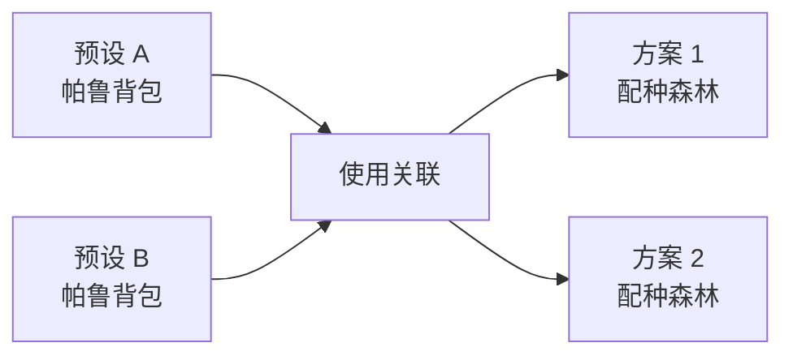

# 已有帕鲁预设与配种图需求

## 1. 文档状态

| 字段 | 内容 |
| --- | --- |
| 需求编号 | REQ-002 |
| 状态 | 阶段 1 已完成，阶段 2–5 待实施 |
| 优先级 | 高 |
| 适用范围 | Web 版与 Windows Electron 版 |
| 核心变化 | 以可编辑配种图完全替换现有自动路径规划 |

本文描述已有帕鲁预设、获取目标帕鲁和可编辑配种图的完整需求。实现不得改变静态帕鲁 Schema、无性别配方数据、图鉴搜索规则或 Electron 安全配置。

## 2. 背景与目标

现有路径规划要求用户先维护一组起点，再由算法一次性生成推荐树。该流程难以表达玩家实际拥有的不同帕鲁集合，也不便于逐步查询、比较、拼接和保存个人方案。

本次调整将工作流改为：

1. 使用“预设”维护可反复切换的已有帕鲁集合。
2. 在“获取目标帕鲁”中查询目标的全部亲本配方。
3. 将配方追加到独立方案，或在画布中手工使用已有帕鲁构建配种关系。
4. 将方案保存为可编辑、可导入导出的有向无环配种森林。

预设可以类比“帕鲁背包”或绘图时选中的颜色；方案是独立画布。选择预设只改变当前可取用的帕鲁队列，不决定方案的归属和生命周期。

## 3. 核心概念与关系

### 3.1 预设

预设是一个具名的帕鲁种类集合：

- 只记录帕鲁 ID，不记录个体数量、性别、等级、词条或其他个体属性。
- 同一帕鲁在一个预设中最多记录一次。
- 预设之间相互独立。
- 预设内容采用显式保存。

### 3.2 方案

方案是一个具名的配种图：

- 保存节点实例、配种关系、节点坐标和画布视口。
- 同一种帕鲁可以在同一方案中出现多个节点实例。
- 方案不属于任何单一预设。
- 删除方案不得删除预设。

### 3.3 多对多关联

预设和方案是多对多关系：



- 一个方案可以先后使用多个预设中的帕鲁。
- 一个预设可以用于多个方案。
- 当前预设和当前方案分别选择，互不强制切换。
- 从当前预设向当前方案添加节点时，建立或刷新二者的使用关联。
- 解除关联只移除快捷关系，不删除预设、方案、节点或配种关系。
- 删除预设只删除相关关联；使用该预设创建的方案节点继续保留。
- 删除方案只删除相关关联；所有预设继续保留。

## 4. 信息架构调整

配种工具保留三个功能页：

| 页面 | 变化 |
| --- | --- |
| 双亲查子代 | 已支持精确双亲查询，以及单选任一亲本时展开、搜索和分页浏览该帕鲁参与的全部配方 |
| 获取目标帕鲁 | 由“子代反查亲本”更名，并增加配方导出 |
| 帕鲁配种图 | 完全替换现有“路径规划” |

旧版最少代数、指定 N 代、自动推荐树、节点替代配方和代数展示上限不再作为用户功能保留。设置页中的“指定代数上限”随旧路径规划一并移除。

## 5. 已有帕鲁预设

### 5.1 帕鲁选择面板

面板默认展示图鉴中的全部帕鲁，并按有效图鉴编号升序排列；无图鉴编号的条目稳定排在末尾。

每个选项使用以下视觉结构：

- 圆形帕鲁头像。
- 头像下方第一行显示中文名。
- 第二行显示图鉴编号；缺失时显示“无编号”。
- 未选中时使用灰色圆形边框。
- 选中时使用绿色圆形边框，并在头像上覆盖绿色 `✓` 图层。
- 选中状态不能只依赖颜色，必须同时具有 `✓`、`aria-checked` 或等价语义。

损坏图片继续显示本地占位，不得将图片加载失败误表示为未选中状态。

### 5.2 搜索与批量操作

- 搜索框只过滤当前显示选项，不修改选择结果。
- 搜索继续复用中文名、不完整拼音、拼音首字母、英文名、内部 ID 和图鉴编号规则。
- 切换搜索条件后，当前预设中已选但被过滤掉的帕鲁仍保持选中。
- “全选结果”只选中当前搜索过滤结果，不影响已选但当前不可见的帕鲁。
- “清空已选”清空当前预设草稿中的全部已选帕鲁，不受搜索条件限制。
- 搜索框提供独立的清空操作；清空搜索不改变选择。

### 5.3 预设管理

必须支持：

- 创建空预设。
- 切换预设。
- 重命名预设。
- 删除预设。
- 保存当前预设。

规则如下：

- 首次进入且没有预设时，创建空的“默认预设”。
- 名称去除首尾空白后长度为 1–30 个字符。
- 预设名称在当前设备上不得重复。
- 选择变化只修改草稿；点击保存后才持久化。
- 草稿与已保存版本不一致时显示“有未保存更改”。
- 切换预设、离开配种工具或关闭应用时，提供“保存并继续 / 放弃更改 / 取消”保护。
- “清空已选”属于草稿操作，保存前可以通过放弃更改恢复。
- 删除预设前显示确认；删除只移除预设和相关多对多关联，不影响任何方案。
- 当前预设被删除后，切换到下一个可用预设；没有其他预设时重新创建空的“默认预设”。

## 6. 获取目标帕鲁

### 6.1 基础查询

- 页面名称由“子代反查亲本”改为“获取目标帕鲁”。
- 用户选择目标帕鲁后，显示全部无性别亲本配方。
- 保留现有搜索、稳定排序和每页 50 条分页。
- 页面和配方卡片不显示亲本或子代性别，不提供性别输入。

### 6.2 配方追加入口

“双亲查子代”和“获取目标帕鲁”的每张完整配方卡片均提供紧凑、可访问的“追加到配种图”按钮。“双亲查子代”包括以下结果来源：

- 已同时选择两个亲本时得到的精确组合结果。
- 只选择任一亲本时展开的该帕鲁全部相关配方。

按钮始终针对卡片所表示的完整 `亲本 A + 亲本 B → 子代` 配方，不依赖当前查询只填写了几个选择框。

点击后：

1. 将内容追加到当前方案，不创建新方案。
2. 始终创建两个新的亲本节点实例和一个新的子代节点实例。
3. 即使画布已有相同帕鲁，也不自动复用或合并。
4. 同种亲本配方创建两个不同节点实例。
5. 创建一条完整配种关系，并保存对应 `recipeIndex`。
6. 新节点组放置到当前视口中的可用区域，亲本在上、子代在下。
7. 导出成功后提供“前往查看”操作，并保持当前目标查询状态。

没有当前方案时按钮禁用，并提供“选择或创建方案”的明确引导。导出不得自动创建方案，也不得修改任何预设。

## 7. 帕鲁配种图

### 7.1 页面布局

页面包含：

1. 当前预设选择器及预设管理入口。
2. 当前方案选择器及方案管理入口。
3. 当前预设帕鲁队列。
4. 配种图画布。
5. 画布工具栏。
6. 与图形等价的文本关系列表。

当前预设和当前方案是两个独立选择器。切换预设不切换方案，切换方案也不强制切换预设。

### 7.2 方案管理

必须支持：

- 创建空方案。
- 切换方案。
- 重命名方案。
- 删除方案。
- 导出当前方案。
- 导入方案。

规则如下：

- 首次进入且没有方案时，创建空的“方案 1”。
- 名称去除首尾空白后长度为 1–40 个字符。
- 方案名称不得重复。
- 节点、关系、位置和视口变化自动保存，并显示保存状态。
- 自动保存采用短延迟合并写入，切换方案或关闭页面前必须刷新待写入内容。
- 删除方案前显示确认；删除只移除方案和相关多对多关联，不影响任何预设。
- 没有剩余方案时显示空状态和“创建方案”入口。

### 7.3 当前预设队列

- 队列展示当前预设已保存的帕鲁。
- 支持使用统一身份搜索过滤队列。
- 帕鲁可以拖入画布并创建新节点。
- 拖动属于复制，不从预设中移除。
- 同一帕鲁可以反复拖入并形成多个节点。
- 键盘和触屏必须提供“添加到画布”替代操作，不能只支持拖动。
- 从预设添加节点时建立当前预设与当前方案的使用关联。

### 7.4 图结构

配种图表现为从上到下的有向无环配种森林：

- 亲本位于上方，子代位于下方。
- 可以同时存在多个互不连接的树或子图。
- 一个子代节点最多拥有一条生成关系。
- 一个节点可以作为多个后续配种关系的亲本。
- 同一种帕鲁允许以多个节点实例出现。
- 图上不显示性别，所有关系均按当前无性别配方索引解释。
- 每个节点显示圆形头像、中文名和图鉴编号。
- 节点必须能够被移动、选择和聚焦。

虽然渲染层可以使用两条父子连线，领域模型必须把“两名亲本共同生成一个子代”保存为一条不可拆分的配种关系。

### 7.5 手工创建子代

“创建子代”工具按以下流程工作：

1. 用户选择两个不同节点实例作为亲本。
2. 两个节点可以代表同一种帕鲁，但不能是同一个节点实例。
3. 系统在本地配方索引中查询无序亲本组合。
4. 没有结果时提示“当前组合没有正式配方”，不修改画布。
5. 有唯一结果时直接创建新的子代节点和关系。
6. 有多个结果时由用户选择具体子代后再创建。
7. 子代节点默认位于两名亲本中点下方。
8. 新子代默认只属于当前方案，不自动加入任何预设。

新子代节点提供“加入当前预设”操作。执行后只修改当前预设草稿，仍需显式保存预设。

### 7.6 节点合并

合并用于减少用户主动确认的重复节点，必须满足：

- 只能合并代表同一帕鲁的节点。
- 由用户明确选择保留节点和被合并节点。
- 合并后所有合法关系重定向到保留节点。
- 一个子代节点合并后仍最多只有一条生成关系。
- 合并不得产生有向循环。
- 合并不得让同一个节点实例同时充当一条关系的亲本和子代。
- 合并不得产生完全重复的关系。

任一条件不满足时拒绝合并，并说明具体原因。不得静默丢弃关系。

### 7.7 删除行为

- 删除关系只移除该关系，不删除三个节点。
- 删除节点同时移除直接连接到该节点的关系，其他节点继续保留并可能成为新的独立树。
- 删除有关系的节点前应显示受影响关系数量。
- 删除操作进入当前会话的撤销栈。

### 7.8 查询节点获取方式

工具栏提供“查询获取方式”工具：

1. 激活工具。
2. 点击一个帕鲁节点。
3. 跳转到“获取目标帕鲁”。
4. 自动将该帕鲁设为当前目标。
5. 保留当前方案、画布视口和当前预设。
6. 用户可将选中的配方继续追加回同一方案。

### 7.9 工具栏

首版工具至少包含：

| 工具 | 功能 |
| --- | --- |
| 选择/移动 | 选择和拖动节点 |
| 平移 | 移动画布 |
| 创建子代 | 使用两个节点查询并创建子代 |
| 查询获取方式 | 跳转到目标配方查询 |
| 合并节点 | 合并合法的同帕鲁节点 |
| 删除 | 删除选中节点或关系 |
| 撤销/重做 | 撤销或重做当前会话编辑 |
| 自动整理 | 按亲本在上、子代在下重新布局 |
| 适应画布 | 将全部节点放入可视区域 |
| 缩放 | 放大和缩小画布 |

工具必须具有文字提示、选中状态和键盘可访问名称。

## 8. 方案导入与导出

### 8.1 导出范围

- 导出对象是当前方案，不包含预设内容。
- 不导出预设与方案的本机多对多关联。
- 文件包含节点、关系、坐标、视口、方案名称、数据集版本和导出时间。
- 文件扩展名建议使用 `.paltools-plan.json`。

### 8.2 导入行为

- 导入始终创建新的独立方案，不覆盖现有方案。
- 导入不要求选择预设，也不修改任何预设。
- 导入完成后可以使用任意预设继续向方案添加节点。
- 名称冲突时追加“（导入）”及递增序号。
- 所有节点和关系 ID 在导入时重新生成，避免与本机数据冲突。

### 8.3 校验

导入必须在写入前完整校验：

- 文件标识和 `schemaVersion`。
- 节点、关系、坐标及视口字段类型。
- 节点 ID 和关系 ID 唯一。
- 所有帕鲁 ID 存在于当前图鉴。
- `recipeIndex` 存在，且对应的亲本和子代与关系一致。
- 每个子代最多一条生成关系。
- 图无有向循环。
- 不包含性别字段；出现未知扩展字段时忽略但不得执行。
- 数据集版本不同则先提示，再使用当前索引重新校验；校验通过后才能导入。

校验失败时整体拒绝导入，列出可定位的问题，不允许部分写入。

建议首版限制单个方案最多 2,000 个节点、2,000 条关系，导入文件不超过 5 MiB，防止异常文件阻塞界面。

### 8.4 文件结构

```ts
interface BreedingPlanExportV1 {
  format: 'paltools-breeding-plan'
  schemaVersion: 1
  datasetVersion: string
  exportedAt: string
  plan: {
    name: string
    nodes: BreedingGraphNodeV1[]
    relations: BreedingRelationV1[]
    viewport: GraphViewportV1
  }
}
```

## 9. 本机状态与数据模型

配种图和多个方案可能超过适合 `localStorage` 的规模，建议使用 IndexedDB，数据库名为 `paltools-breeding`，首版数据库版本为 1。

```ts
interface PalPresetV1 {
  id: string
  schemaVersion: 1
  name: string
  palIds: string[]
  createdAt: string
  updatedAt: string
}

interface BreedingPlanV1 {
  id: string
  schemaVersion: 1
  name: string
  nodes: BreedingGraphNodeV1[]
  relations: BreedingRelationV1[]
  viewport: GraphViewportV1
  createdAt: string
  updatedAt: string
}

interface PlanPresetLinkV1 {
  planId: string
  presetId: string
  lastUsedAt: string
}

interface BreedingGraphNodeV1 {
  id: string
  palId: string
  position: { x: number; y: number }
  source: 'preset' | 'recipe-export' | 'manual-child' | 'import'
}

interface BreedingRelationV1 {
  id: string
  parentANodeId: string
  parentBNodeId: string
  childNodeId: string
  recipeIndex: number
}
```

建议使用独立对象存储保存预设、方案、关联和界面元数据。当前预设 ID 与当前方案 ID 分开保存，任何一方损坏或缺失时都独立回退。

## 10. 旧版迁移

由于帕鲁配种图完全替换路径规划，实现时需要：

- 移除“路径规划”页及其最少代数、指定 N 代和推荐树入口。
- 移除设置页“指定代数上限”。
- 停止使用路径规划 Worker 和旧代数配置；确认无其他消费点后删除死代码和测试。
- 首次迁移时读取 `paltools.path-starts.v1`，将合法帕鲁 ID 导入名为“旧版已有帕鲁”的预设。
- 已存在同名预设时使用递增后缀，且迁移只执行一次。
- 原始旧键至少保留一个发布周期以支持版本回退，不自动删除用户数据。
- `paltools.admin-config.v1` 中仅服务旧代数上限的配置停止使用，但不在迁移时主动删除。

静态 `breeding-index.json`、无性别配方规范化和完整性断言保持不变。

## 11. 无性别显示规则

- 双亲查子代、获取目标帕鲁、配种图节点、关系、文本列表和导出文件均不显示性别。
- 不新增性别筛选、性别图标或性别字段。
- 相同两种亲本的顺序只影响视觉位置，不改变无序配方查询。
- 同种亲本通过两个独立节点实例表达。

## 12. 可访问性与响应式

- 预设头像选项使用复选语义，支持 Tab、方向键、Space 和 Enter。
- 搜索、全选结果、清空已选、保存和预设管理均有明确标签。
- 拖放必须有键盘及触屏替代操作。
- 图形画布之外始终提供等价文本关系列表，包含 `亲本 A + 亲本 B → 子代`。
- 工具栏使用可聚焦按钮、提示文字和非颜色激活状态。
- 删除、导入失败、非法合并和无配方结果使用可读状态消息，不只依赖颜色。
- 桌面端优先三栏或侧栏加画布；窄屏下预设队列和工具栏可折叠，画布仍可平移缩放。
- 不产生页面级横向溢出，画布内部滚动或平移不得带动背景页面。

## 13. 性能与安全边界

- 300 个帕鲁的默认选择面板应在普通桌面设备上流畅滚动和过滤。
- 普通预设切换、搜索和节点选择目标低于 100ms。
- 500 个节点以内的自动整理目标低于 500ms；更大方案允许显示进行中状态。
- 方案自动保存不得阻塞拖动和缩放。
- 所有数据保存在本机，不新增运行时第三方请求、账号、云同步或遥测。
- 导入 JSON 只作为数据解析，不执行任何脚本、HTML 或外部资源地址。
- 画布节点图片仍只引用当前包内合法路径。

## 14. 验收标准

### 预设

- 默认展示全部帕鲁，头像、名称和图鉴编号完整。
- 未选中为灰色圆框；选中为绿色圆框并有绿色 `✓`。
- 搜索只过滤展示；“全选结果”只选当前结果；“清空已选”清空全部选择。
- 创建、切换、重命名、删除、显式保存和未保存保护均有效。
- 删除预设不删除方案或方案节点。

### 多对多关系

- 同一预设可以用于多个方案。
- 同一方案可以先后使用多个预设。
- 当前预设和当前方案可独立切换。
- 解除关联和删除任一对象不级联删除另一对象。

### 获取目标帕鲁

- 页面更名正确，原反查搜索、排序和分页保持可用。
- 每张配方可以追加到当前方案。
- 每次导出均创建三个新节点和一条合法关系。
- 没有当前方案时不会静默创建或丢失导出内容。

### 双亲查询配方追加

- 精确双亲结果和单亲展开结果中的每张完整配方均可追加到当前方案。
- 单亲搜索过滤只改变当前展示，不改变配方内容或追加结果。
- 每次追加均使用卡片的两个实际亲本和子代创建三个新节点及一条合法关系。
- 没有当前方案时禁用追加并给出明确引导。

### 配种图

- 预设帕鲁可拖入或通过替代操作加入画布。
- 同一帕鲁可拥有多个节点实例。
- 两个节点可创建合法子代；无结果和多结果状态处理正确。
- 新子代可选择加入当前预设，也可只保留在方案中。
- 图保持亲本在上、子代在下的有向无环森林结构。
- 合并只允许相同帕鲁，并拒绝循环、多生成关系和其他非法结果。
- 节点可跳转到“获取目标帕鲁”，并将配方追加回原方案。
- 图形与文本关系列表内容一致。
- 所有图形和文本均无性别显示。

### 持久化与交换

- 刷新和重启后预设、方案、关联、节点位置及视口保持。
- 当前方案可导出并重新导入为独立方案。
- 非法、超限或与当前数据不兼容的文件整体拒绝。
- 旧版已有帕鲁集合只迁移一次，原数据不被主动删除。

### 质量门

- 领域测试覆盖预设解析、关系校验、循环检测、合并和导入校验。
- 组件测试覆盖选择面板、显式保存、独立切换、多对多关系和配方导出。
- 真实浏览器覆盖拖放及替代操作、工具栏、自动保存、导入导出、窄屏和主题。
- 最终执行完整测试、TypeScript、数据校验、生产构建和一次 EXE 打包 smoke。

## 15. 分阶段实施计划

实施拆分为 5 个阶段。每个阶段都必须保持主分支可构建、现有非目标功能可用，并完成该阶段对应的定点测试后才能进入下一阶段。

| 阶段 | 目标 | 主要交付物 |
| --- | --- | --- |
| 1（已完成，2026-07-30） | 移除旧路径工具并建立新领域基础 | 干净的信息架构、领域 Schema、IndexedDB 仓储和迁移能力 |
| 2 | 完成预设与方案资源管理 | 预设选择面板、独立方案管理、多对多关联 |
| 3 | 建立可持久化的配种森林核心 | 节点、配种关系、基础画布、自动布局和文本关系列表 |
| 4 | 完成编辑工具与目标查询闭环 | 完整工具栏、配方追加、节点跳转和跨页面上下文 |
| 5 | 完成可移植性与发布验收 | JSON 导入导出、可访问性、响应式、性能和 EXE 发布门 |

### 阶段 1：移除旧工具并建立领域与存储基础（已完成）

实施结果：旧路径页、Worker、算法、代数设置及无消费样式/测试已删除；正反向查询保持；第三入口替换为“帕鲁配种图”空状态。新增纯领域 zod Schema、图关系与静态配方一致性校验、`paltools-breeding` IndexedDB v1 仓储、方案与多预设原子写入，以及 `paltools.path-starts.v1` 的过滤、同名后缀和仅一次迁移。旧已有帕鲁键与 `paltools.admin-config.v1` 均未主动删除。

验证记录：12 个测试文件共 66 项通过，TypeScript、300 个帕鲁/44,851 条无性别配方的数据校验和生产构建通过。真实 Chromium 覆盖正向查询、反向查询、配种图空状态、五主题设置、键盘进入、1440×900、1152×720、1366×768 与 390×844；未发现横向溢出、破图、控制台警告/错误或第三方运行时请求。阶段 1 不执行 EXE 打包，最终桌面发布 smoke 留在阶段 5。

#### 范围

1. 从配种工具中删除“路径规划”模式及其页面入口。
2. 删除旧版最少代数、指定 N 代、自动推荐树和节点替代配方 UI。
3. 删除路径规划 Worker、无消费的路径算法、对应消息类型、样式和测试。
4. 从设置页删除“指定代数上限”，停止消费旧代数配置。
5. 保留双亲查子代和现有子代反查功能，确保重构期间仍有完整配方查询能力。
6. 在第三个配种功能页放置“帕鲁配种图”空状态，作为后续阶段稳定入口。
7. 定义预设、方案、多对多关联、图节点、配种关系、视口和导出文件的纯领域 Schema。
8. 实现关系一致性、一个子代至多一条生成关系、无环结构和节点 ID 唯一性校验。
9. 建立 IndexedDB 仓储接口、数据库升级机制和原子写入边界。
10. 实现旧 `paltools.path-starts.v1` 的一次性迁移逻辑；迁移结果暂由仓储测试验证，阶段 2 再通过预设界面展示。
11. 停止使用 `paltools.admin-config.v1` 中仅服务旧代数上限的字段，但至少保留一个发布周期，不主动删除用户数据。
12. 更新当前产品和架构文档，明确旧路径工具已移除、新配种图尚处于分阶段建设中。

#### 明确不包含

- 不实现预设选择面板。
- 不实现可编辑画布。
- 不实现配方导出或 JSON 文件导入导出。

#### 退出条件

- 代码检索中不存在旧路径页、Worker 和代数设置的有效消费点。
- 双亲查子代、子代反查、图鉴、主题和设置中的其他功能保持通过。
- 新领域 Schema、仓储和迁移逻辑具有独立单元测试。
- 静态无性别配方索引及其完整性断言未被修改。
- 完整测试、TypeScript、数据校验和生产构建通过。

### 阶段 2：预设与方案资源管理

#### 依赖

阶段 1 的领域 Schema、IndexedDB 仓储和迁移能力。

#### 范围

1. 实现默认展示全部帕鲁的预设选择面板。
2. 实现圆形头像、中文名、图鉴编号、灰色未选中圆框和绿色选中 `✓`。
3. 接入统一身份搜索，并实现“全选结果”“清空已选”和搜索框独立清空。
4. 实现预设创建、切换、重命名、删除、草稿、显式保存和未保存离开保护。
5. 将阶段 1 迁移的旧已有帕鲁集合展示为“旧版已有帕鲁”预设。
6. 实现方案创建、切换、重命名、删除和空方案状态。
7. 当前预设和当前方案使用独立选择器，切换任一方不得隐式切换另一方。
8. 实现预设与方案的多对多关联，以及解除关联和独立删除规则。
9. 建立方案自动保存框架和保存状态反馈；本阶段只需保存空方案元数据与视口默认值。
10. 在帕鲁配种图页面完成预设区、方案区、当前预设队列和空画布的稳定布局。

#### 明确不包含

- 预设队列暂不向画布创建节点。
- 不创建配种关系。
- 不改名或扩展“子代反查亲本”。

#### 退出条件

- 预设选择、过滤、批量操作、显式保存和未保存保护通过组件测试。
- 预设与方案可独立增删改查，并正确维护多对多关联。
- 删除预设不删除方案，删除方案不删除预设。
- 刷新和重启后当前预设、当前方案及关联保持。
- 迁移只执行一次，旧存储键未被主动删除。
- 默认主题及桌面、窄屏布局无横向溢出。

### 阶段 3：可持久化配种森林核心

#### 依赖

阶段 2 的预设队列、方案生命周期和自动保存框架。

#### 范围

1. 支持从当前预设队列拖入帕鲁并创建新节点。
2. 提供键盘和触屏可用的“添加到画布”替代操作。
3. 同一种帕鲁可以反复加入并形成多个节点实例。
4. 从预设添加节点时建立或刷新当前预设与当前方案的关联。
5. 实现节点选择、移动、画布平移、缩放和适应画布。
6. 实现“创建子代”基础流程：
   - 选择两个不同节点实例；
   - 使用无序、无性别配方索引查询；
   - 唯一结果直接创建；
   - 多结果由用户选择；
   - 无结果不修改画布。
7. 新子代始终创建为新节点，位于亲本中点下方，不自动加入预设。
8. 实现亲本在上、子代在下的自动整理布局。
9. 实现与画布等价的 `亲本 A + 亲本 B → 子代` 文本关系列表。
10. 将节点、关系、位置和视口接入方案自动保存，并在切换方案前刷新待写入内容。
11. 始终执行无环、单生成关系和配方一致性校验。
12. 画布、节点、关系和文本列表均不显示性别。

#### 明确不包含

- 暂不实现节点合并、撤销/重做和目标查询跳转。
- 暂不从配方卡片追加到方案。
- 暂不提供方案 JSON 导入导出。

#### 退出条件

- 可从一个或多个预设向同一方案添加节点。
- 可从同一预设向多个方案添加节点。
- 唯一结果、多结果、无结果和同种亲本流程均有领域与组件测试。
- 方案刷新后节点、关系、坐标和视口完整恢复。
- 图保持有向无环，一个子代最多一条生成关系。
- 图形画布与文本关系列表结果一致。

### 阶段 4：完整编辑工具与目标查询闭环

#### 依赖

阶段 3 的稳定图模型、自动保存和关系创建能力。

#### 范围

1. 完成选择/移动、平移、创建子代、查询获取方式、合并、删除、撤销/重做、自动整理、适应画布和缩放工具。
2. 实现同帕鲁节点合并，并拒绝循环、多生成关系、自关联和重复关系。
3. 实现删除关系、删除节点及受影响关系数量提示。
4. 新子代节点提供“加入当前预设”，只修改预设草稿并继续要求显式保存。
5. 将“子代反查亲本”更名为“获取目标帕鲁”，保留搜索、排序和分页。
6. 为“获取目标帕鲁”及“双亲查子代”的每张完整配方卡片增加“追加到配种图”按钮，覆盖精确双亲结果和单亲展开结果。
7. 每次追加都向当前方案创建两个新亲本节点、一个新子代节点和一条关系，不复用已有节点。
8. 没有当前方案时禁用追加，并引导用户选择或创建方案。
9. 实现节点“查询获取方式”跳转，自动设置目标并保留当前预设、当前方案和画布视口。
10. 从目标查询返回或追加配方后继续编辑原方案。
11. 统一所有配种页面的无性别文案和可访问名称。

#### 退出条件

- 工具栏全部功能具有可见状态、文字提示和键盘名称。
- 合并和删除不会破坏图结构或静默丢失关系。
- “获取目标帕鲁 → 追加配方 → 返回配种图”流程完整。
- “双亲查子代（精确双亲/单亲展开）→ 追加配方 → 返回配种图”流程完整。
- “节点 → 查询获取方式 → 追加回原方案”流程完整。
- 每次追加均创建独立节点实例，同种亲本也创建两个节点。
- 跨页面快速切换不会覆盖错误方案或丢失未写入变更。

### 阶段 5：导入导出、可访问性与发布验收

#### 依赖

阶段 4 已完成全部核心业务闭环。

#### 范围

1. 实现当前方案 `.paltools-plan.json` 导出。
2. 实现方案整体校验、ID 重建、名称冲突处理和独立导入。
3. 导入不得创建、修改或绑定预设，不得覆盖已有方案。
4. 实现数据集版本差异提示，并使用当前配方索引重新验证全部关系。
5. 对非法、超限、循环、未知帕鲁和配方不一致文件执行全量拒绝，不允许部分写入。
6. 完成预设网格、当前队列、工具栏、画布和弹窗的键盘导航。
7. 验证拖动的键盘与触屏替代操作、焦点恢复和屏幕阅读器状态消息。
8. 完成八套主题、桌面、125% 缩放、1366×768、窄屏和低高度回归。
9. 验证大预设、500 节点方案、自动布局、自动保存和导入文件限制下的性能。
10. 更新 README、产品需求、架构、统一需求清单和路线图，将本需求移入已完成记录。
11. 清理阶段建设期间遗留的占位文案、兼容分支和无消费样式。

#### 退出条件

- 导出后重新导入得到等价、独立且可继续编辑的方案。
- 非法或不兼容文件不会产生任何部分写入。
- 预设、方案、关联和旧数据迁移在刷新、重启及异常恢复后正确。
- 图形与文本均无性别显示，运行时无第三方请求。
- 无页面级横向溢出、破图、控制台错误或键盘陷阱。
- 完整测试、TypeScript、数据校验、生产构建和一次 EXE 打包 smoke 全部通过。
